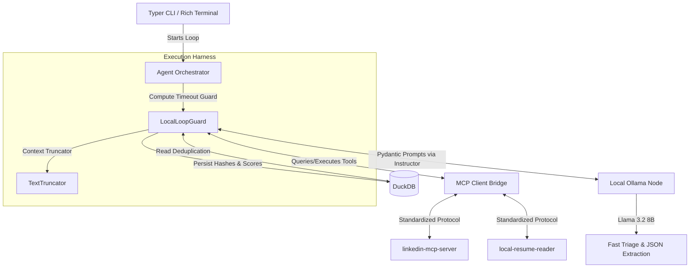

# OPEN-JOB-LOOP

```text
   ____  ____  _____ _   __       __________  ____       __    ____  ____  ____ 
  / __ \/ __ \/ ___// | / /      / / / / __ \/ __ )     / /   / __ \/ __ \/ __ \
 / / / / /_/ / __/ /  |/ /  __  / / / / / / / __  |    / /   / / / / / / / /_/ /
/ /_/ / ____/ /___/ /|  /  / /_/ / /_/ / /_/ / /_/ /   / /___/ /_/ / /_/ / ____/ 
\____/_/   /_____/_/ |_/   \____/\____/\____/_____/   /_____/\____/\____/_/
```

OPEN-JOB-LOOP is a fully autonomous, privacy-first CLI agent that executes in closed loops (Plan-Act-Observe-Evaluate) to discover, deduplicate, evaluate technical fit, and structure job applications. The system runs entirely on open-weight local models, bypassing paid cloud APIs completely.

## Architecture



## Features

- **Local-First Inference**: Operates locally with Ollama / llama.cpp models.
- **Mandatory Structured Outputs**: Powered by `instructor` and Pydantic.
- **Context Window Management**: Strips boilerplate/HTML to fit smaller local models securely.
- **VRAM/Compute Awareness**: Custom `LocalLoopGuard` utilizes timeouts over token budgeting to avoid stalling.
- **Stateless Runs**: On-the-fly deduplication mapping via DuckDB SHA256 hashes.
- **Rich User Interface**: Stunning CLI feedback utilizing the `rich` library.

## How to Use

### Prerequisites
- Python 3.12+
- `uv` package manager (para baixar o MCP e dependências rapidamente)
- [Ollama](https://ollama.com/) instalado com o modelo base (ex: `ollama run llama3.2:3b`)

### Instalação
Clone o repositório e crie um ambiente virtual:
```bash
git clone https://github.com/Helfstein-one/open-job-loop.git
cd open-job-loop
uv venv .venv
source .venv/bin/activate
uv pip install -e .
```

### Execução em Mock (Para Testes)
Se você não quiser usar o plugin do LinkedIn real ainda, pode rodar o pipeline com dados fixos (mocks) para verificar o processamento, truncação e inferência local do Llama3.2 gravando no DuckDB:
```bash
python -m src.cli run --mock --limit 3
```

### Execução Real (Mundo Real via MCP)
Para rodar garimpando vagas ativas reais do LinkedIn:

1. **(Opcional) Setup inicial do Plugin MCP:** Se for sua primeira vez, é recomendado rodar o plugin solto para permitir que ele baixe o navegador `Patchright` de forma silenciosa e abra a janela de login do LinkedIn para você (faça o login na janela que abrir e aperte `CTRL+C` no terminal):
   ```bash
   uvx mcp-server-linkedin@latest
   ```

2. **Inicie o Agente:**
   ```bash
   python -m src.cli run --no-mock --keywords "Python Software Engineer" --limit 5
   ```

3. **Autenticação Automática:** Se o script parar com a mensagem `MCP Plugin waiting for setup/login`, é porque o plugin está solicitando sua senha de usuário do macOS (Keychain) ou abrindo o LinkedIn. Basta conceder acesso e o pipeline continuará sozinho em um loop de retry até pegar as vagas!

4. **Dashboard:** O painel irá exibir vagas Descartadas e Shortlisted dependendo do "Fit Score" gerado pela IA local!

## License

MIT License
