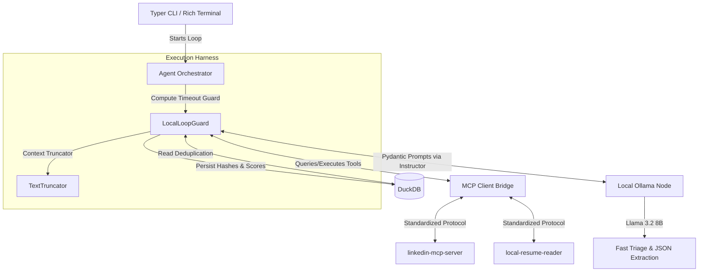

# OPEN-JOB-LOOP

```text
     _
   //\
   V  \
    \  \_
     \,'.`-.
      |\ `. `.
      ( \  `. `-.                        _,.-:\
       \ \   `.  `-._             __..--' ,-';/
        \ `.   `-.   `-..___..---'   _.--' ,'/
         `. `.    `-._        __..--'    ,' /
           `. `-_     ``--..''       _.-' ,'
             `-_ `-.___        __,--'   ,'
                `-.__  `----"""    __.-'
                     `--..____..--'
               NANO BANANA POWERED
```

OPEN-JOB-LOOP is a fully autonomous, privacy-first CLI agent that executes in closed loops (Plan-Act-Observe-Evaluate) to discover, deduplicate, evaluate technical fit, and structure job applications. The system runs entirely on open-weight local models, bypassing paid cloud APIs completely.

## Architecture



## Features

- **Local-First Inference**: Operates locally with Ollama / llama.cpp models.
- **Mandatory Structured Outputs**: Powered by `instructor` and Pydantic.
- **Context Window Management**: Strips boilerplate/HTML to fit smaller local models securely.
- **VRAM/Compute Awareness**: Custom `LocalLoopGuard` utilizes timeouts over token budgeting to avoid stalling.
- **Stateless Runs**: On-the-fly deduplication mapping via DuckDB SHA256 hashes.
- **Rich User Interface**: Stunning CLI feedback utilizing the `rich` library.

## How to Use

### Prerequisites
- Python 3.12+
- Local Ollama running (e.g., Llama 3.2 model)
- Appropriate MCP servers configured

### Installation
```bash
git clone https://github.com/yourusername/open-job-loop.git
cd open-job-loop
pip install -r requirements.txt
```

### Execution
Run the loop:
```bash
python -m src.cli
```

## License

MIT License
