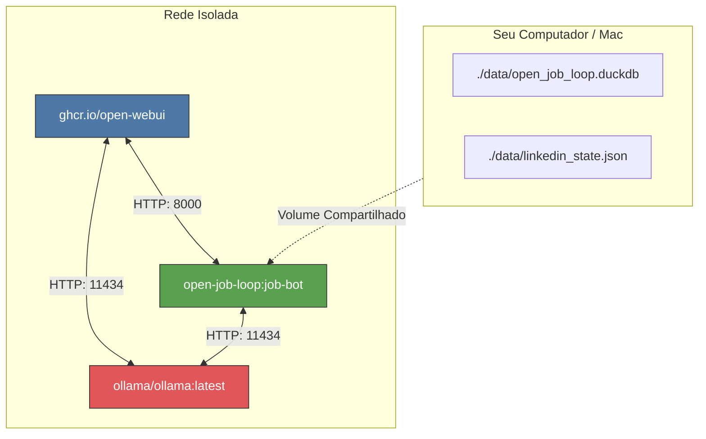

# OPEN-JOB-LOOP

```text
   ____  ____  _____ _   __       __________  ____       __    ____  ____  ____ 
  / __ \/ __ \/ ___// | / /      / / / / __ \/ __ )     / /   / __ \/ __ \/ __ \
 / / / / /_/ / __/ /  |/ /  __  / / / / / / / __  |    / /   / / / / / / / /_/ /
/ /_/ / ____/ /___/ /|  /  / /_/ / /_/ / /_/ / /_/ /   / /___/ /_/ / /_/ / ____/ 
\____/_/   /_____/_/ |_/   \____/\____/\____/_____/   /_____/\____/\____/_/
```

O **OPEN-JOB-LOOP** evoluiu de uma CLI simples para um verdadeiro **Agente Autônomo de Carreira Pessoal**. Ele executa um pipeline complexo (Busca - Triagem - Deduplicação - Preenchimento de Formulários) para garantir que você só foque nas vagas de alto nível técnico ("Fit Score"). Tudo isso encapsulado em Microserviços (Docker/Podman) e acessível via chat interativo (Open WebUI).

## 🚀 Novidades da V2
- **Hexagonal Architecture (Ports & Adapters)**: Código rigorosamente estruturado com SOLID (`domain/`, `application/`, `infrastructure/`, `presentation/`).
- **Automação "Easy Apply"**: Robô integrado ao Playwright que preenche os formulários do LinkedIn de forma invisível.
- **RAG & Currículo Vetorial**: Utiliza `DuckDB VSS` para armazenar o seu currículo em memória vetorial, permitindo que a IA redija respostas perfeitas e customizadas para as perguntas abertas do recrutador na hora de aplicar.
- **Microserviços (Docker/Podman)**: Infraestrutura isolada composta por 3 containers (`open-webui`, `ollama`, `job-bot`).
- **API Híbrida**: O core é ativado tanto por CLI (Typer) quanto por Endpoints REST (FastAPI).

---

## 🏗 Arquitetura & Jornada do Agente

O fluxo de funcionamento do projeto foi desenhado para ser totalmente autônomo. Abaixo você confere o caminho que uma vaga percorre desde a descoberta até a candidatura final:

```mermaid
sequenceDiagram
    participant User as 🧑‍💻 Você
    participant UI as 💬 Open WebUI
    participant API as ⚙️ FastAPI (job-bot)
    participant MCP as 🔍 LinkedIn MCP
    participant Llama as 🧠 Ollama (Llama 3.2)
    participant DB as 💾 DuckDB (VSS)
    participant Bot as 🤖 Playwright
    
    User->>UI: "Aplique para vagas de Python"
    UI->>API: POST /start {keywords: "Python"}
    
    rect rgb(30, 30, 30)
        Note right of API: 1. DESCOBERTA E TRIAGEM
        API->>MCP: Buscar vagas no LinkedIn
        MCP-->>API: Lista de Vagas Brutas
        API->>DB: Checa Hash (Deduplicação)
        API->>Llama: Prompt: Avalie as vagas inéditas
        Llama-->>API: Retorna "Fit Score" (0-100)
        API->>DB: Salva vagas boas como SHORTLISTED
    end
    
    rect rgb(30, 30, 50)
        Note right of API: 2. AUTO-APPLY (Assíncrono)
        API->>Bot: Inicia worker de aplicação
        Bot->>DB: Puxa vagas SHORTLISTED
        Bot->>MCP: Navega invisível (linkedin_state.json)
        Bot->>Bot: Clica em "Easy Apply" e extrai perguntas
        Bot->>DB: Busca semântica (RAG) da resposta ideal no seu currículo VSS
        Bot->>Bot: Preenche e Clica em "Submit"
        Bot->>DB: Atualiza status para APPLIED
    end
    
    UI->>API: GET /report
    API-->>UI: Retorna JSON consolidado
    UI-->>User: "Relatório: 15 vagas aplicadas com sucesso!"
```



### Topologia de Containers (Podman/Docker)



---

## 🛠 Como Usar (Deploy em 3 Passos)

### 1. Requisitos
- **Docker** ou **Podman** instalados na sua máquina.

### 2. Subindo a Infraestrutura
Abra o terminal na pasta do projeto e inicie os microserviços:
```bash
# Se usar Docker:
docker-compose up -d --build

# Se usar Podman:
podman-compose up -d --build
```
*Isso fará o download do Playwright e do Open WebUI.*

### 3. Baixando a Inteligência
Com os containers rodando, instrua o seu nó do Ollama a baixar os modelos Open-Weight necessários:
```bash
# Se usar Docker:
docker exec ollama ollama pull llama3.2:3b
docker exec ollama ollama pull nomic-embed-text

# Se usar Podman:
podman exec ollama ollama pull llama3.2:3b
podman exec ollama ollama pull nomic-embed-text
```

### 4. A Ponte com o LinkedIn (Login Manual Seguro)
O LinkedIn barra robôs sem sessão. Para o `Auto-Apply` funcionar:
1. Rode na sua máquina: `python src/presentation/linkedin_auth.py`
2. O navegador se abrirá. Faça login na sua conta normalmente.
3. Aperte `ENTER` no terminal. Seus cookies de sessão serão criptografados e salvos em `data/linkedin_state.json`. O Container lerá esse arquivo a partir de agora e será invisível.

---

## 🗣 Operação pelo Open WebUI

Abra seu navegador e acesse **`http://localhost:8080`**.
1. Crie sua conta administrativa local.
2. Na aba **Workspace > Tools**, crie uma Tool chamada `JobBot` e cole o conteúdo do nosso arquivo `src/presentation/open_webui_tool.py`.
3. No chat, ative a Tool e diga: *"Inicie uma busca por vagas de Desenvolvedor Python Pleno"*.
4. O container `job-bot` receberá o POST, buscará vagas via MCP, passará pelo filtro vetorial do Llama 3.2, e começará o Auto-Apply no background.

Se quiser saber o status, basta pedir ao chat: *"Me dê o relatório diário das vagas processadas"*.

## 🧪 Desenvolvimento e Testes

O projeto conta com mais de 90 testes separados nas camadas Hexagonais usando `pytest`:
```bash
# Rodar Testes Unitários
pytest tests/unit

# Rodar Integração
pytest tests/integration

# End-to-End
pytest tests/e2e
```

## License

MIT License
